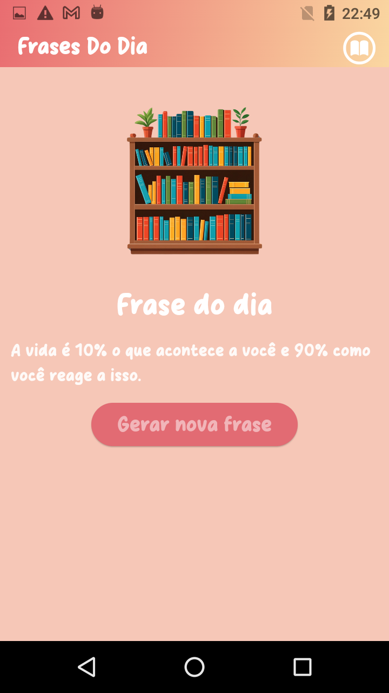

# 📖 pharses

Aplicativo simples em Flutter onde são geradas randomicamente frases de cunho motivacional

### 🎯 Objetivo:

O objetivo foi desenvolver habilidades para maior entendimento do Flutter/Dart no geral e como construir aplicação nos mesmo, inserir uma nova fonte no projeto, a alocação das imagens e seu enquadramento, alinhamentos da tela e adquirir noções de front-end

## 📷 Projeto

